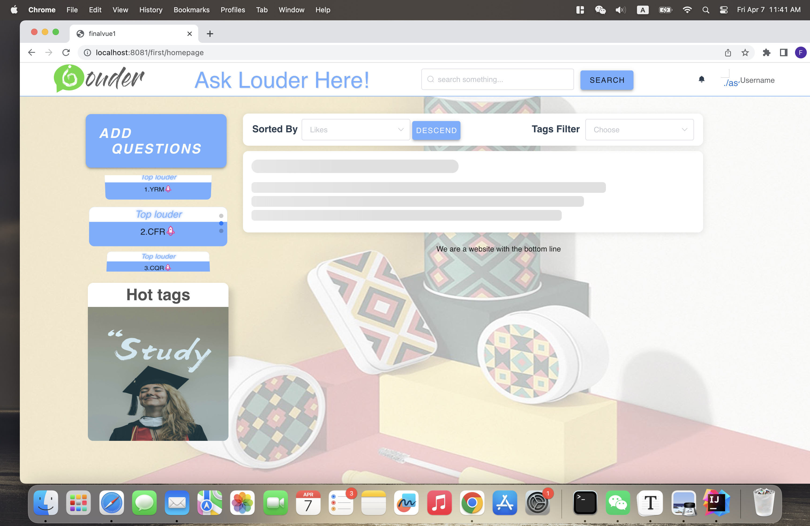

# Q-A-Web-Application-Front-End

### 1.简介

西交利物浦大学软件开发项目

实现了一个在线问答平台的前端部分

技术栈： vue3 + vuex + vue-router + webpack + ElementUI

项目原地址： https://gitee.com/yngrxxm/finalvue1/tree/master/finalvue1

### 2.下载与使用

- 1.下载代码

  ```shell
  git clone https://github.com/FENGRUI99/Q-A-Web-Front-End.git
  cd finalvue1
  ```

- 2.安装依赖

  ```java
  npm install
  ```

  **macbook m1芯片**装chromedriver会报错，需单独执行`npm install chromedriver@87.0.1`

- 使用

  ```shell
  npm run dev
  ```

### 3. 页面功能实现

- 封面页
- 登陆页
  - 登陆
- 注册页
  - 注册
- 主页
  - 按照名称，发布时间，热度排序
  - 按照类型筛选
  - 搜索问题
  - 无限下拉+骨架图展示问题
  - 点击提问按钮
- 个人详情页
  - 个人资料修改
  - 密码修改
  - 发布问题和回答问题
- 问题详情页
  - 问题详情展示
  - 回复展示
  - 相关问题展示
- 聊天页
  - 选择好友聊天

### 3.界面展示部分



